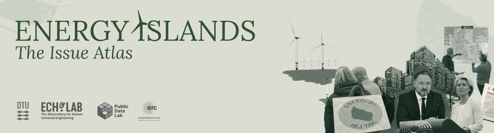

# Energy Islands. The Issue Atlas

### What is the Issue Atlas? 

The Issue Atlas is a PDF report that serves as a teaching resource for the analysis of sociotechnical controversies. It draws on a concept from Science & Technology Studies and allows students to follow how concerns on a specific topic are raised by actors over time. The report also provides background information on the case, explains the methods used, and presents key features of the data. It is accompanied by additional case material, including datasets and tools for further exploration.

[Report](docs/Energy%20Islands-Issue%20Atlas-June2025.pdf)

### Additional case material 

- A dataset of actor statements, with metadata, issue classification and semantic analysis, available as both csv and markdown
- A set of Python notebooks for searching, filtering, and visualising the corpus, available as both ipynb and in Google Colab.

[Link to folder with materials](https://drive.google.com/drive/folders/19hZb6YMqiNfNoDT3qz6LmUCO5PHX8tXH)

### Contributors

This case material came together thanks to the work and input of the students from the Science, Technology and Society course in DTU, January 2025.

### Project team

[ECHO LAB](https://echolab-dtu.github.io/web/), [Good by devicing - ERC project](https://www.good-by-devicing.org/), [Public data lab](https://publicdatalab.org/)

- Mathieu Jacomy
- Anders Kristian Munk
- Sarah Feldes
- Ainoa Pubill
- Julia Kirch Kirkegaard
- Tom Cronin
- Daniel Nordstrand Frantzen
- Emil Nissen
- Sebastian Husted

### Disclaimer! 

_This case material is for teaching purposes only. It contains paraphrased statements by real-world actors in the controversy around the Danish energy island projects. All paraphrased statements are based on actual statements made directly by the actors, or by others quoting those actors, in publicly available sources. The statements have been translated to English, harmonized to appear as direct first-person utterances that can be understood without further context, and were anonymized if they are not made by an organization or a person speaking in an official capacity. The statements are not intended as research data and should not be quoted as evidence outside the teaching context. The authors of this case material maintain the linked list of original sources for all statements. Since links may break over time, we also maintain the list of verbatim excerpts from the original sources that were used to create the paraphrased actor statements. These excerpts are not made public with the dataset._

